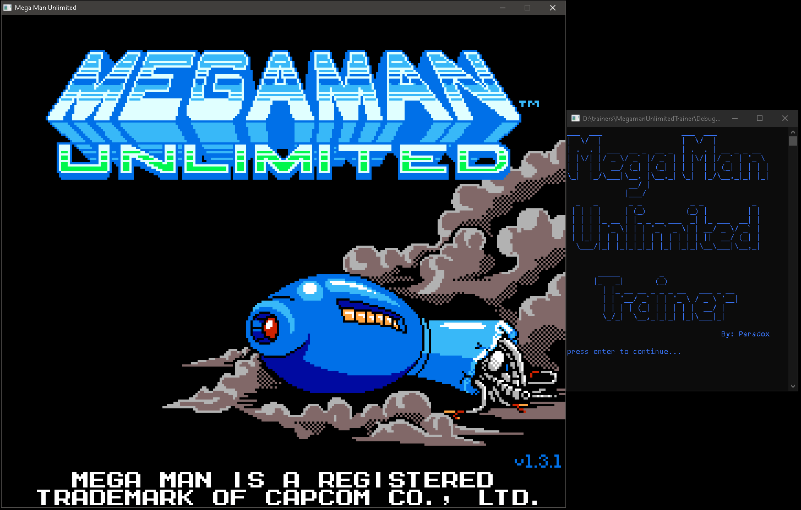
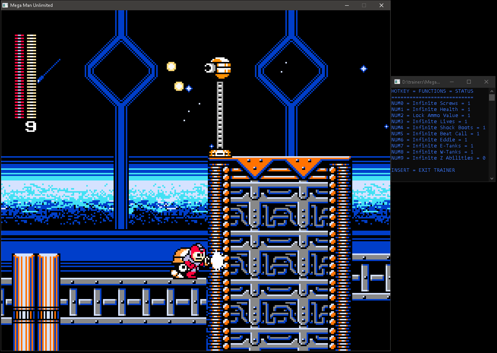
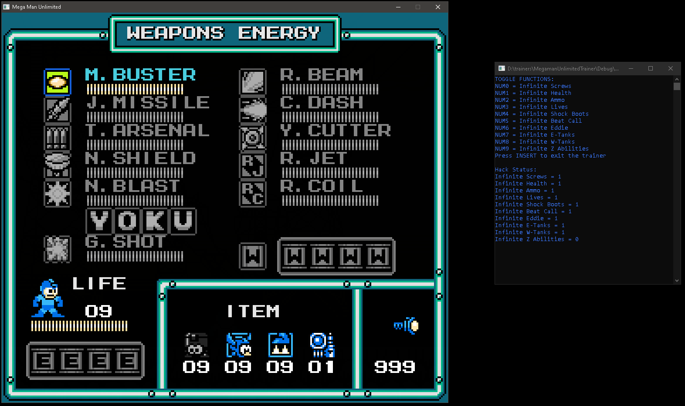

# MegamanUnlimitedTrainer
Trainer for Mega Man Unlimited.
 
 
Includes:
 
Cheat Engine Table (CT file)
 
Source code for c++ trainer
 
Exe for c++ trainer in Debug folder
 
 
Notes: You can only survive one hit kill rainbow attacks by setting the health value higher than max.
The c++ trainer does this by default(automatically sets it to 99 health bars).
 
Z-Prototype can use Megaman's Beat and shock boots if you set their values higher than zero.
The c++ trainer does this by default(automatically sets both to 9).
 
 
Screenshots:
 

  

 

  

 

  

